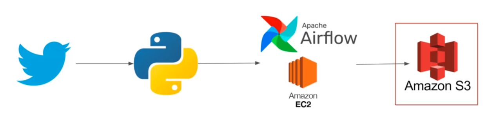

# Twitter Data Pipeline with Apache Airflow (AWS EC2 → S3)

Automated pipeline that extracts tweets via **Tweepy**, transforms to a clean tabular format with **Pandas**, and orchestrates the workflow using **Apache Airflow** on **AWS EC2**, landing daily CSVs in **Amazon S3**.

---

## Why this project matters

- **End-to-end ownership**: I designed, coded, deployed, scheduled, and monitored a cloud data pipeline.
- **Real orchestration**: Shows understanding of DAGs, retries, scheduling, and task observability in Airflow.
- **Cloud-native storage**: Production-style landing in S3 (partitioning by date is easy to add).
- **Security & DevEx**: Uses IAM roles for EC2→S3 and environment variables for keys (no secrets in code).

---

## Tech Stack

- **Python 3.x**: `pandas`, `tweepy`, `s3fs`
- **Apache Airflow** (2.x) on **AWS EC2**
- **Amazon S3** for data lake storage
- **IAM Role** for secure, keyless S3 access from EC2
- (Optional) **Docker/virtualenv** for reproducible environments

---

## Project Structure

